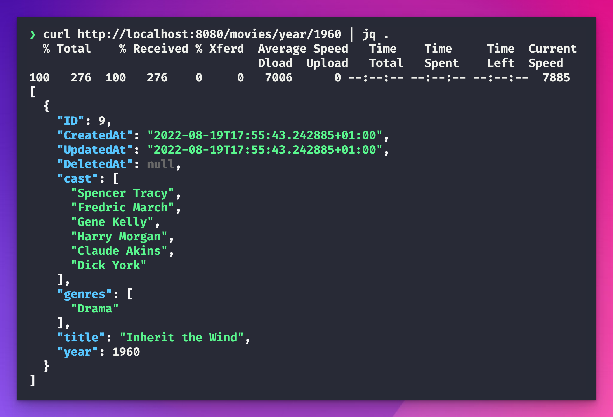

# movie-data-api

A hypothetical challenge to manage movie data and save that data to a database from remote providers such as S3.

It would be accessed via a REST API.



_Uploading_

```
curl -X POST http://localhost:8080/movie -H 'Content-Type: application/json' -d '{
    "title": "Avengers: Age of Ultron",
    "year": 2015,
    "cast": [
      "Robert Downey, Jr.",
      "Chris Evans",
      "Chris Hemsworth",
      "Mark Ruffalo"
    ],
    "genres": [
      "Action"
    ]
}'
"OK"
```

### Brief

**Requirements**

✅Build an API for querying data as workload in a Kubernetes cluster; data can be queried by year, movie name, cast member or genre

✅API must be available 24/7 with zero downtime

✅API must return response time within 5ms 

✅Choose a data storage solution that is fit for purpose

✅Prepare a diagram describing the chosen architecture

✅Implementation can be in any programming language

✅Assume data format is that of the provided data set; see resources below.
 
**Assumptions**

- Each S3 update will be a single file with N movie entries
- It is not clear how S3 will send the data, I will assume the use of S3 event [notifications](https://docs.aws.amazon.com/AmazonS3/latest/userguide/NotificationHowTo.html)
- "API must return response time within 5ms"  (  unclear whether this is first or last byte, past demarkation point or not ), I will assume that this is first byte

### Resources

Movie data set https://github.com/prust/wikipedia-movie-data

## Architecture

### Code architecture diagram


### Infrastructure architecture diagram


_When the statefulset is created it dynamically fetches and injects the PG secret for the database_


## Setup to reproduce

- Requires the following global envs set ( these will produce a Kubernetes secret which is injected into the STS)
  - AWS_ACCESS_KEY_ID
  - AWS_SECRET_ACCESS_KEY
  - AWS_REGION
  - AWS_BUCKET

- Create a 3 node MicroK8s cluster on hardware or cloud ( you could also use K.I.N.D/minikube but figure out your own distributed block storage)
- MicroK8s enable `mayastor dns metallb` This will give you DNS, distributed storage and ingress
- Run `make up` 
- Query the service via the cluster Load balancer or port forwarding ( see resources below )


### Local development

When connecting to a PG cluster locally with a port forward, you can use the following command to connect to the cluster:

```
go run main.go --postgres-password=$(kubectl get secrets movie-db-cluster-app -o jsonpath="{.data.password}" | base64 -d)

```

_Testing a query_

```
curl localhost:8080/movies/year/2015
curl localhost:8080/movies/castmember/Tom%20Cruise
```
