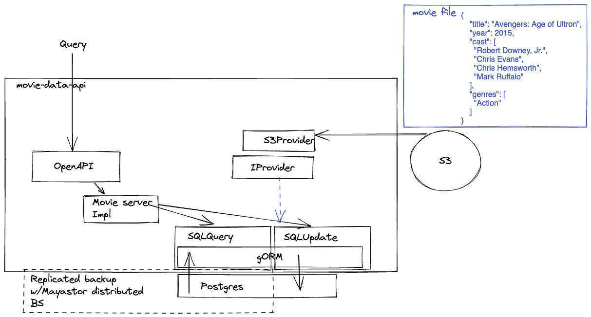
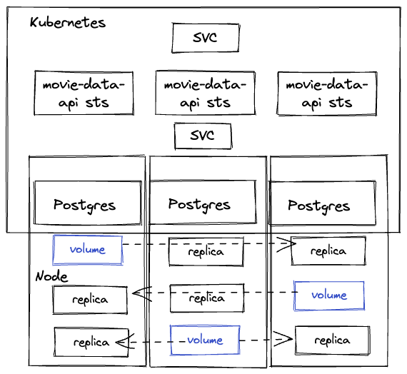
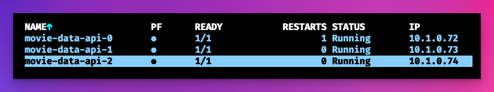

# movie-data-api

A hypothetical challenge to manage movie data and save that data to a database from remote providers such as S3.

It would be accessed via an OpenAPI3 compliant REST API.


### Brief

**Requirements**

✅Build an API for querying data as workload in a Kubernetes cluster; data can be queried by year, movie name, cast member or genre

✅API must be available 24/7 with zero downtime

✅API must return response time within 5ms 

✅Choose a data storage solution that is fit for purpose

✅Prepare a diagram describing the chosen architecture

✅Implementation can be in any programming language

✅Assume data format is that of the provided data set; see resources below.
 
**Assumptions**

- Each S3 update will be a single file with N movie entries
- There is no specification for data to be loaded immediately from S3 into the movie-data-api
- 5ms latency requirement is from ingress to service first byte.


### Resources

Movie data set https://github.com/prust/wikipedia-movie-data

## Architecture

### Code architecture diagram

OpenAPI3 [spec](https://github.com/AlexsJones/movie-data-api/blob/main/pkg/swagger.yaml) is used to generate the server types and handlers.



### Infrastructure architecture diagram




_When the statefulset is created it dynamically fetches and injects the PG secret for the database_




## Installation

- Create a 3 node MicroK8s cluster on hardware or cloud ( you could also use K.I.N.D/minikube but figure out your own distributed block storage)
  - MicroK8s enable `mayastor dns metallb` This will give you DNS, distributed storage and ingress

- Install your AWS credentials into the cluster namespace
```
kubectl create secret generic aws-auth --from-literal=AWS_ACCESS_KEY_ID=$AWS_ACCESS_KEY_ID --from-literal=AWS_SECRET_ACCESS_KEY=$AWS_SECRET_ACCESS_KEY
````
_This is used by the statefulset to construct auth_

```
          - name: "AWS_ACCESS_KEY_ID"
            valueFrom:
              secretKeyRef:
                name: "aws-auth"
                key: "AWS_ACCESS_KEY_ID"
```


- Run `AWS_REGION=$AWS_REGION AWS_BUCKET_NAME=<existing bucket name> make up` 
- Query the service via the cluster Load balancer or port forwarding ( see resources below )

### Testing

_Replace with your bucket name_


```
#!/bin/bash
for i in scripts/00*; do
    aws s3 cp $i s3://<existing bucket name>/$i
done
```

Port forward the postgres DB if you wish to run locally 

`kubectl port-forward svc/movie-db-cluster-rw 5432:5432`


```
curl localhost:8080/movies/year/2015
curl localhost:8080/movies/castmember/Tom%20Cruise
```
